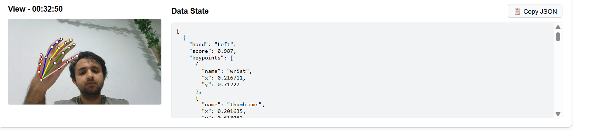
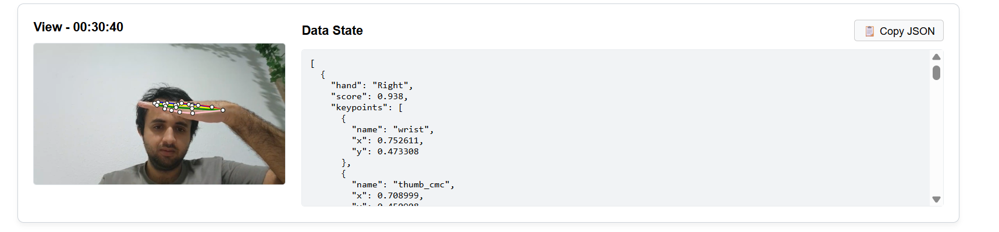
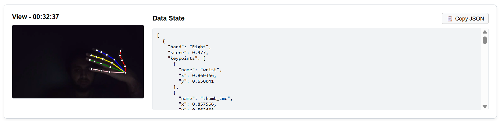
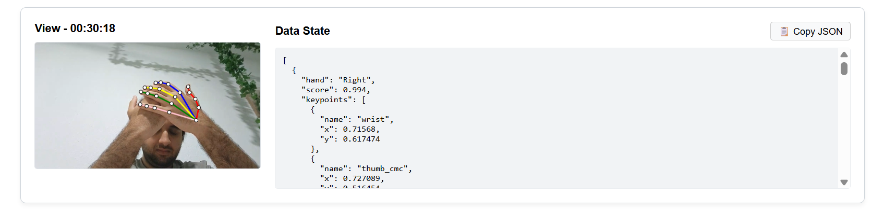
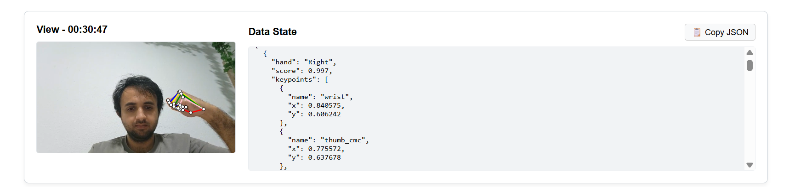
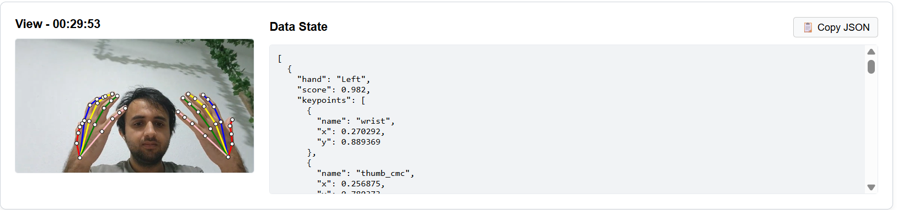

# Sprint 1: Proof of Concept – Kamera- & Körperdaten im Browser

## Starten des Projekts

Führen Sie die folgenden Befehle im Terminal aus, um die Anwendung zu starten:

```bash
pnpm install
pnpm run dev

```

## Begründung der ML-Library

Für dieses PoC wurde `@tensorflow-models/hand-pose-detection` in Kombination mit dem **MediaPipe**-Backend über WebGL ausgewählt.

**Warum diese Library?**

- **Client-seitig:** Sie läuft vollständig lokal im Browser. Es wird kein Python-Backend benötigt.
- **Performance:** Das `full`-Modell wurde für die Evaluierung getestet und liefert höhere Präzision. Für den normalen Betrieb verwendet die Anwendung standardmäßig das `lite`-Modell, weil es im Browser ressourcenschonender läuft. Beide Modellvarianten sind in der Core-Engine vorbereitet.
- **Datenformat:** Die Library liefert direkt die exakten 21 Hand-Landmarks (Knöchel und Gelenke) im 3D-Raum sowie einen Confidence-Score.
- **Keine Abstraktion:** Die Library liefert reine Rohdaten. Dadurch haben wir die volle Kontrolle darüber, wie die Daten formatiert, normalisiert und weiterverwendet werden.
- **Erweiterbarkeit & Zukunftssicherheit:** Da das Kern-Tracking vollständig in einer headless `tracker.ts` Engine gekapselt ist, bleibt das Projekt flexibel. Das TensorFlow/MediaPipe-Ökosystem erlaubt es uns, in späteren Sprints problemlos weitere Modelle (z. B. für Face-Mesh oder Ganzkörper-Pose-Tracking) zu integrieren oder die extrahierten Koordinaten an ein nachgelagertes Klassifikations-Modell zur Gestenerkennung zu übergeben.
- **Typisierung & Schnittstellensicherheit durch TypeScript:** Die Verarbeitung von 21 dreidimensionalen Koordinatenpunkten pro Hand erfordert eine extrem präzise Datenstruktur. Durch den Einsatz von TypeScript wurden strikte Interfaces für die Daten-Payloads (z. B. für die Keypoints und Konfigurationen) definiert. Dadurch wird bereits zur Compile-Zeit garantiert, dass optionale Werte (wie die Z-Achse oder fehlende Landmarks bei Verdeckung) im UI-Code sicher abgefangen werden und die Berechnungsschleife vor `runtime undefined`-Fehlern geschützt ist.

## Eigene Erweiterungen zur Evaluierung

Um die Anforderungen des PoC („Was ist Rauschen und was ist zuverlässig?“) professionell testen zu können, wurden die folgenden Debugging-Tools implementiert:

1. **Headless-Tracker-Architektur:** Die ML-Logik (`tracker.ts`) wurde als reine Daten-Engine aufgebaut und strikt von der React-UI getrennt.
2. **Skeleton-Overlay:** Ein Canvas-Overlay zeichnet die 21 Landmarks in Echtzeit, um direkt visuell prüfen zu können, ob die Rohdaten hinsichtlich der Positionierung korrekt sind.
3. **Log-History-Tool:** Ein eingebautes Dashboard, mit dem Edge-Cases per Knopfdruck als kombiniertes Bild (inklusive Skeleton-Visualisierung und JSON-Dump) festgehalten werden können.

## Projektstruktur & Software-Architektur

Um eine saubere Trennung von Geschäftslogik und Benutzeroberfläche zu garantieren (**Separation of Concerns**), wurde die Codebasis strikt modular aufgeteilt:

- **`src/Core/` (Die Core-Tracking-Engine):** Enthält die reine, framework-agnostische JavaScript/TypeScript-Logik (`tracker.ts`). Dieser Bereich verarbeitet ausschließlich die mathematischen Datenströme und weiß nichts von der visuellen Darstellung.
- **`src/UI/` (Die Präsentationsschicht):** Beinhaltet alle React-Komponenten (`App.tsx`, `TrackerControls.tsx`, `HandLogHistory.tsx`), die für die Benutzeroberfläche, Steuerelemente und das Zeichnen des Canvas-Overlays zuständig sind.

**Architektonischer Vorteil für den Übergang vom Prototyp zur Library:**
Diese Struktur wurde bewusst gewählt, um eine einfache Skalierung und spätere Produktivsetzung zu ermöglichen. Wenn das System von der aktuellen Prototyp-Phase in eine echte, wiederverwendbare Bibliothek überführt wird, kann der gesamte Ordner `src/Core/` isoliert herausgelöst werden. Die gesamte Frontend-UI sowie die rein für die Demo benötigten npm-Pakete in der `package.json` lassen sich restlos entfernen. Zurück bleibt eine extrem schlanke, hochperformante und universell einsetzbare Headless-Library, die in jedem beliebigen Setup (Vanilla JS, Vue, Angular etc.) implementiert werden kann.

## Einschätzung der Datenqualität

Um die Qualität der Rohdaten vernünftig bewerten zu können, wurde das Snapshot-Log-Feature genutzt, um spezifische Frames inklusive JSON-Output einzufrieren und zu analysieren.

**Standard-Tracking:** Das Tracking funktioniert unter normalen Bedingungen einwandfrei.



- **Rauschen & Jitter (Unzuverlässig):** Die reinen Pixelkoordinaten des Modells zittern permanent im Millisekunden-Takt, auch wenn die Hand komplett stillgehalten wird. Um das zu beheben, wurde ein „Decimal Precision“-Filter in die Core-Logik eingebaut. Wenn man die Werte normalisiert (0.0 bis 1.0) und zum Beispiel auf 3 Nachkommastellen kürzt, wird das Rauschen erfolgreich geglättet.
- **Webcam-Spiegelung:** Kameras im Browser sind standardmäßig gespiegelt. Das Modell verwechselt linke und rechte Hände, wenn nicht explizit das Flag `flipHorizontal: true` übergeben wird.
- **Räumliche Tiefe (Z-Achse):** Obwohl das Kamerabild nur 2D ist, berechnet das Modell die Tiefe (Z-Achse). Legt man beispielsweise die Fingerspitzen flach nach hinten, spiegelt sich diese Wölbung korrekt in den Tiefenwerten wider.



- **Low-Light Performance (Stabil):** Das Modell ist extrem robust gegenüber schlechten Lichtverhältnissen. Selbst bei starkem Bildrauschen der Kamera und im Halbdunkel werden die Hände noch zuverlässig mit einem Score von >0.97 erkannt und sauber getrackt.



- **Verdeckung & Occlusion (Limitierung):** Wenn sich zwei Hände stark überlappen oder eine Faust geballt wird, verliert das Modell an Präzision. Es versucht, die verdeckten Knöchel (z. B. die hinteren Finger einer Faust oder verdeckte Handflächen) zu „erraten“. Das führt zu leicht verschobenen Vektoren im Skeleton-Overlay.




- **Multi-Hand Tracking:** Das Modell erkennt problemlos mehrere Hände gleichzeitig („Left“ und „Right“) und liefert saubere, isolierte Daten-Arrays für jede erkannte Hand.



## Projektaufwand

- **Zeitaufwand (Sprint 1):** ca. 16 Stunden (inkl. Recherche, Architektur-Setup, Debugging und Dokumentation).
